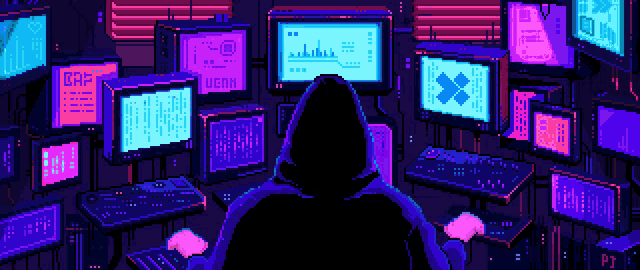

  

  
  
  

 

  I’m a Computer Science undergraduate and <strong>Full Stack Developer</strong> with hands-on experience building and scaling real-world software systems.
  I enjoy designing <strong>end-to-end products</strong>—from clean, responsive user interfaces to reliable backend services—with a strong focus on clarity, performance, and maintainability.

<h3>🔍 What I’m Working On</h3>
<ul>
  <li>Deepening expertise in the <strong>MERN stack</strong></li>
  <li>Building <strong>Spring Boot–based microservices</strong></li>
  <li>Exploring <strong>AI-driven systems</strong>, including applied ML, LLM-powered tools, and retrieval-based architectures</li>
</ul>

<h3>💼 Experience</h3>

<strong>Software Engineering Intern — Lowe’s India</strong>

<ul>
  <li>Delivered production-grade features</li>
  <li>Improved backend reliability and test coverage</li>
  <li>Strengthened CI/CD security and contributed to distributed systems</li>
</ul>

<h3>🚀 Interests</h3>
<ul>
  <li>AI-powered developer and learning tools</li>
  <li>System design and scalable architectures</li>
  <li>Projects that value ownership, learning, and long-term impact</li>
</ul>

<h3>🤝 Let’s Connect</h3>

  I’m always open to collaborating on meaningful projects, open-source work, or product ideas.
  If anything here aligns with your interests, feel free to reach out.

  

  
  
  

  
 
 
  

  

  
  
  

 

  

 

  
  
  

  

  

  
 
      

<b>Profile Views</b>

